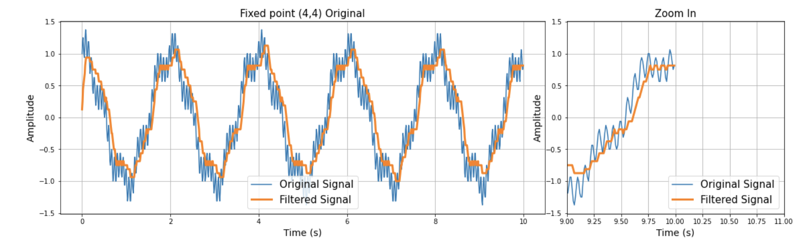
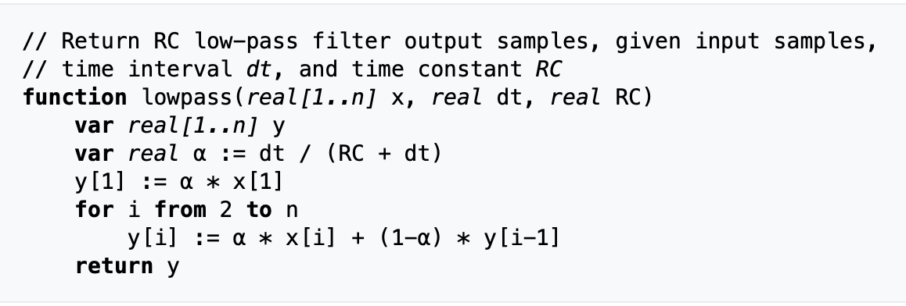

## SIGNAL PROCESSING. Fixed Point VS Floating Point

### Introduction
In the following assignment the FIR filter and the process of applying fixed and floating point are introduced.

**GAOLS**: 

- Implement low-pass filter with different numerical systems in order to observe what is the defference in output of the FIR filter. 
- Analyse filtered signals graphically
- Analyse execution time
- Analyse errors.

For the experiment low-pass filter is chosen and pseudo code is taken from wikipedia. 
First, the original signal is created and converted to fixed and/or floating points. 
Then the signal iterates inside the loop where main formula is applied with coefficients. The filtered signal is stored and returned.

**Results**: 
- Floating point is more presice than fixed point. It has smaller error.
- Due to usage of Numpy and limitations of class "list" flaoting point is faster. However, in hardware and low level languages Fixed point would be faster.

**One of the outputs (example)**: 

**Low-pass filter:**

Source:
- https://stackoverflow.com/questions/62448904/how-to-implement-continuous-time-high-low-pass-filter-in-python
- https://en.wikipedia.org/wiki/Low-pass_filter
- https://helpful.knobs-dials.com/index.php/Low-pass_filter
